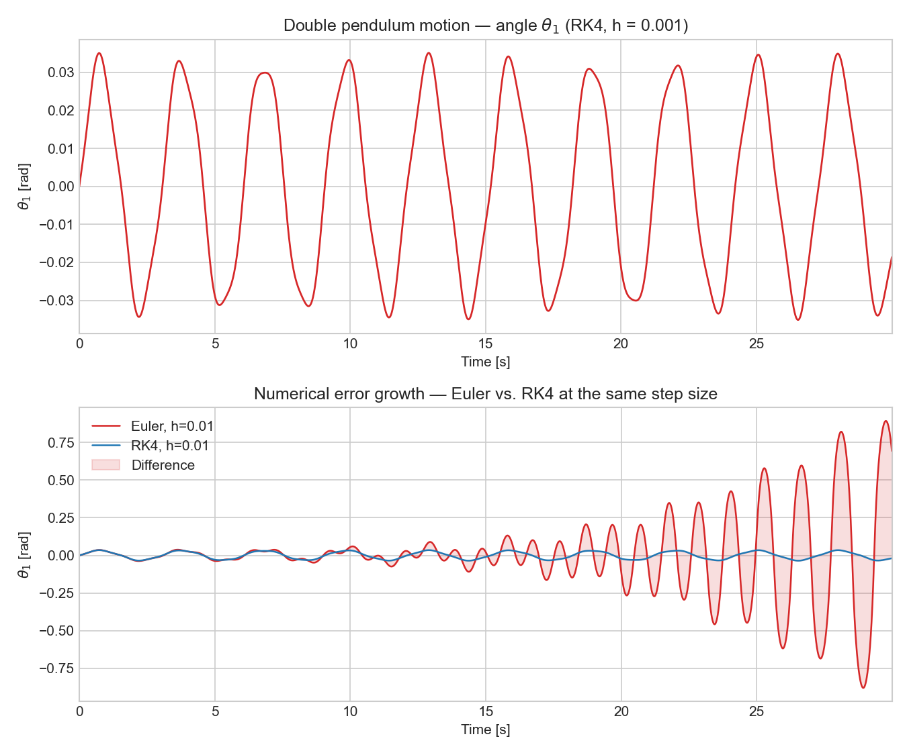
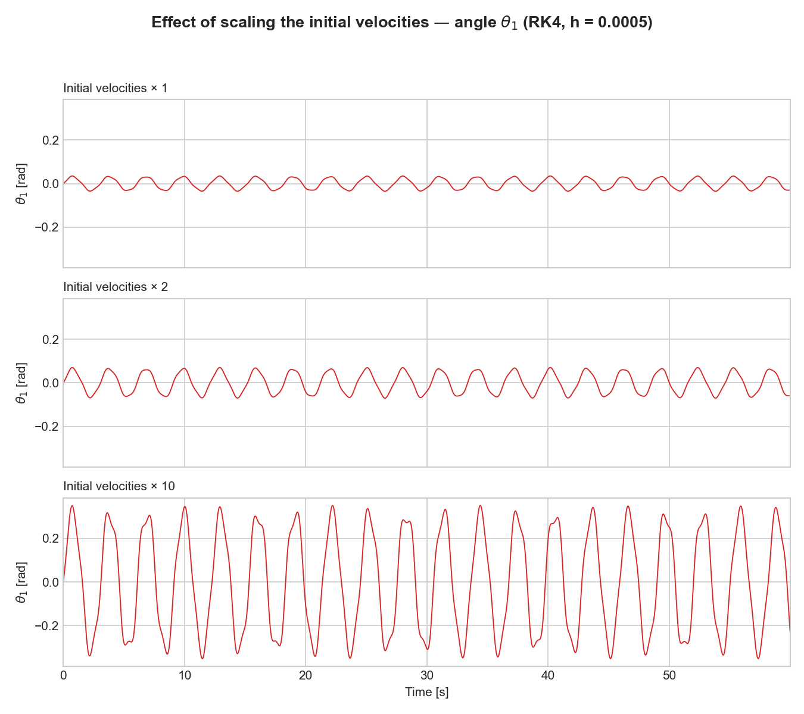
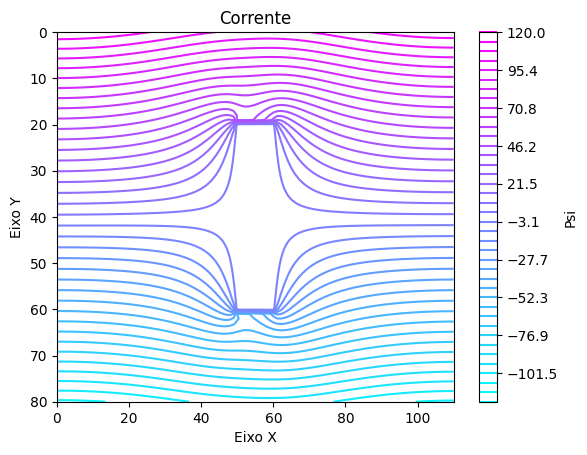
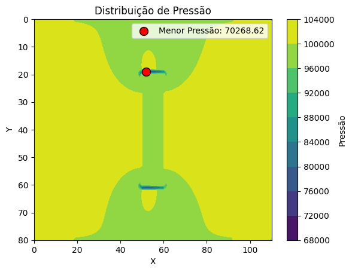
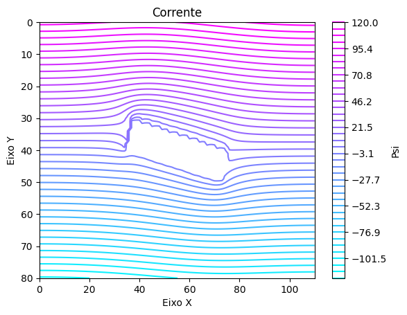
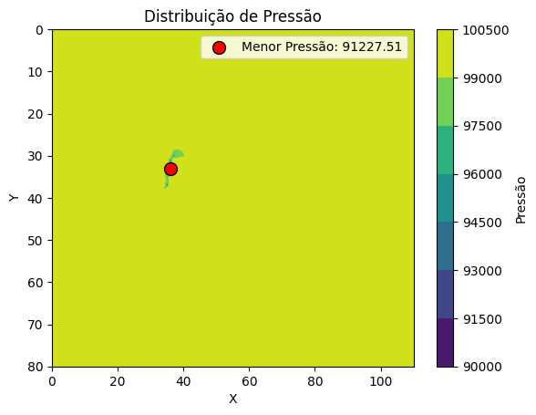

# Numerical Simulations: PMR 3401

Numerical methods coursework for **PMR 3401** (Escola Politécnica da USP), covering two classic problems in mechanical/aerospace engineering: the dynamics of a double pendulum and the potential flow around a flat-plate airfoil.

The full assignment statement (in Portuguese) is available in [`Enunciado.pdf`](Enunciado.pdf). All ODE and PDE solvers are implemented from scratch (no black-box `solve_ivp`/symbolic toolboxes), as required by the assignment.

## Exercise 1: Double pendulum (Runge-Kutta method)

Simulates the dynamics of a double pendulum, two masses `m1` and `m2` connected by massless rigid rods of lengths `l1` and `l2`, derived from the Lagrangian equations of motion, and compares two numerical integration schemes:

- **Euler's method** ([`Ex1/euler.py`](Ex1/euler.py))
- **4th-order Runge-Kutta (RK4)** ([`Ex1/rk4.py`](Ex1/rk4.py))

Both integrate the system for the angles, angular velocities and angular accelerations of each mass, and the results are compared for different step sizes `h` and different initial angular velocities, to illustrate the effect of step size and initial conditions on numerical stability.

- [`Ex1/plot.py`](Ex1/plot.py): plots position, velocity and acceleration for both masses.
- [`Ex1/resultados.ipynb`](Ex1/resultados.ipynb): notebook running the simulations and producing the plots/discussion.

Example output: the top panel shows the motion of the pendulum (angle `θ1`, RK4 with `h = 0.001`); the bottom panel compares Euler and RK4 at the same coarse step (`h = 0.01`), with the shaded area highlighting how Euler's error grows over time relative to RK4:



**Item 2: effect of the initial velocities.** Scaling the initial angular velocities by 2× and 10× pushes the pendulum from the small-angle, quasi-periodic regime into the fully nonlinear/chaotic one: the oscillation grows in amplitude and its waveform becomes visibly less regular, since the double pendulum is chaotic and highly sensitive to the size of both its initial conditions and its integration error:



## Exercise 2: Potential flow around a flat plate (Finite Difference Method)

Solves the 2D potential flow (stream function formulation, `∇²ψ = 0`) around a flat plate placed in a uniform free stream, for two angles of attack (`θ = 90°` and `θ = 15°`), using the **Successive Over-Relaxation (SOR)** method to solve the resulting linear system, including the **Kutta condition** at the plate's trailing/leading edges.

From the converged stream function, the velocity field, pressure field (via Bernoulli's equation) and the resulting lift/drag forces on the plate are computed.

- [`Ex2/utils.py`](Ex2/utils.py): geometric helpers (point rotation, normal vector computation).
- [`Ex2/main.py`](Ex2/main.py): `Point`, `Retangle` and `Mesh` classes implementing the mesh, the SOR relaxation of the stream function, and the velocity/pressure/force post-processing, plus plotting routines (streamlines, velocity field, pressure contours, plate mask, normal vectors).
- [`Ex2/resultados_15.ipynb`](Ex2/resultados_15.ipynb): results for `θ = 15°`.
- [`Ex2/resultados_90.ipynb`](Ex2/resultados_90.ipynb): results for `θ = 90°`.

Example output: stream function and pressure distribution for both angles of attack. At `θ = 90°` the plate blocks the flow head-on, a bluff body with a large low-pressure wake; at `θ = 15°` the flow stays attached and streamlined, closer to the free-stream pressure everywhere:

| Stream function (`θ = 90°`) | Pressure distribution (`θ = 90°`) |
| --- | --- |
|  |  |

| Stream function (`θ = 15°`) | Pressure distribution (`θ = 15°`) |
| --- | --- |
|  |  |

## Requirements

- Python 3.10+
- [NumPy](https://numpy.org/)
- [Matplotlib](https://matplotlib.org/)
- Jupyter (to run the `.ipynb` notebooks)

```bash
pip install numpy matplotlib jupyter
```

## Running

```bash
# Exercise 1
jupyter notebook Ex1/resultados.ipynb

# Exercise 2
jupyter notebook Ex2/resultados_15.ipynb
jupyter notebook Ex2/resultados_90.ipynb
```

## Reference

Anderson, J. D. *Fundamentals of Aerodynamics*, 2nd ed. McGraw-Hill, New York.
